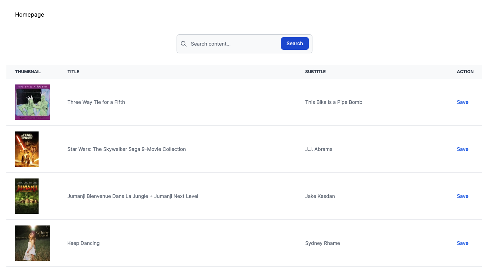
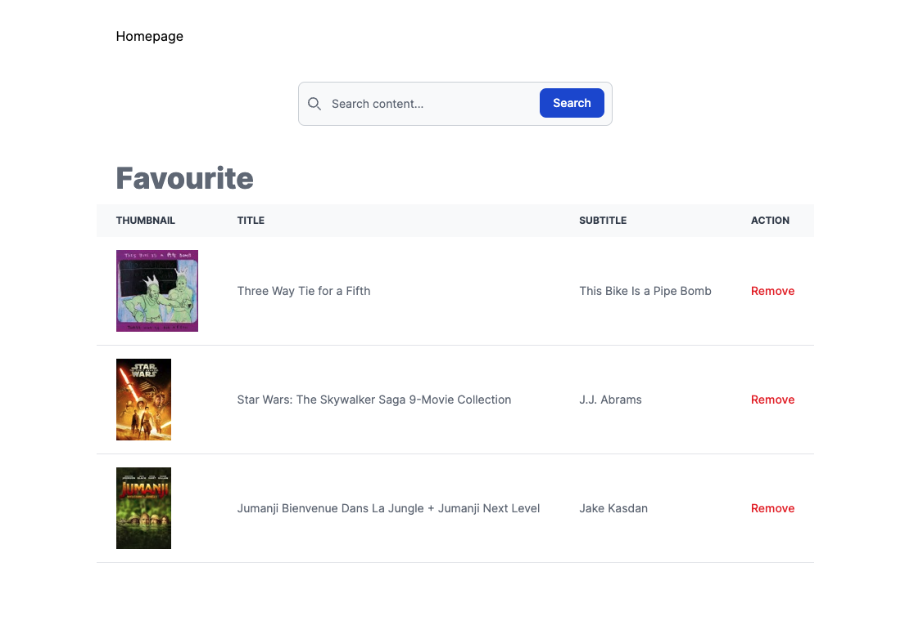

# Search iTunes albums

`Requirements`: Ruby 3.2.2, Postgresql 14

This is a demo of a simple Rails app that searches iTunes albums by artist name and save favorite albums to a database.

### Installation

- Install dependencies: `bundle install`
- Setup DB: `rails db:setup`

### To run the app

1. In project dir: `rails s`
2. Visit `http://localhost:3000/`

### To run the tests

- In project dir: `rspec`

### To run quality control tools

- In project dir: `rubocop` and `reek`

### Using docker-compose

1. In project dir: `docker-compose up --build`
2. Create DB `docker-compose exec app  rails db:setup`
3. Visit `http://localhost:3000/`

### Examples

---

