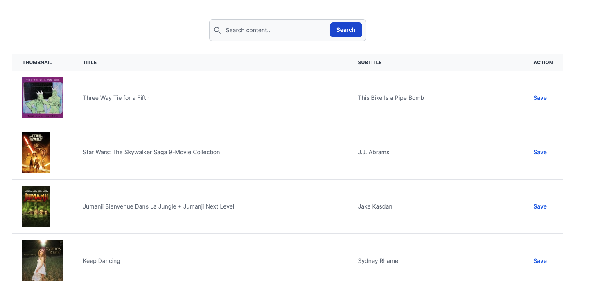

# Search iTunes albums

`Requirements`: Ruby 3.2.2

### Homepage

### Installation

In project dir: `bundle install`

### To run the app

1. In project dir: `rails s`
2. Visit `http://localhost:3000/`

### To run the tests

- In project dir: `rspec`

### To run quality control tools

- In project dir: `rubocop` and `reek`
